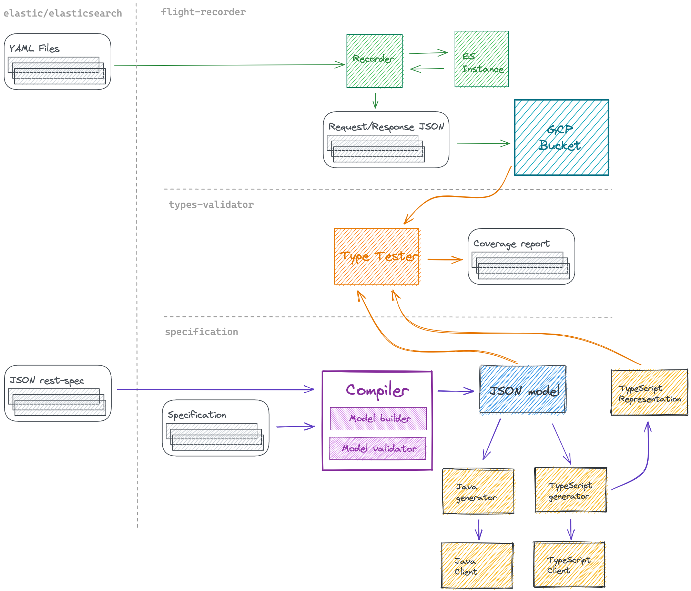

# Elasticsearch API Specification

The **Elasticsearch API Specification** provides the contract for communication between client and server components within the Elasticsearch stack.
With almost 500 API endpoints and around 3000 data types across the entire API surface, this project is a vitally important part of sustaining our engineering efforts at scale.

The repository has the following structure:

| Path | Description |
| -------- | ------- |
| [`api-design-guidelines/`](api-design-guidelines/) | Knowledge base of best practices for API design. |
| [`compiler/`](compiler/) | TypeScript compiler for specification definition to JSON. |
| [`compiler-rs/`](compiler-rs/) | |
| [`docs/`](docs/) | |
| [`output/`](output/) | |
| [`specification/`](specification/) | Elasticsearch request/response definitions in TypeScript. |
| [`typescript-generator/`](typescript-generator/) | |

This JSON representation is formally defined by [a set of TypeScript definitions (a meta-model)](./compiler/src/model/metamodel.ts)
that also explains the various properties and their values.

> [!TIP]
> To learn more about how to write docs specifically for our [API references](https://www.elastic.co/docs/api/), refer to the [Contribute to Elastic API docs](https://www.elastic.co/docs/extend/contribute/api-docs/).

## Prepare the environment

For generating the JSON representation and running the validation code you need
to install and configure Node.js in your development environment.

You can install Node.js with [`nvm`](https://github.com/nvm-sh/nvm):

```sh
curl -o- https://raw.githubusercontent.com/nvm-sh/nvm/v0.40.1/install.sh | bash
```

Once the installation is completed, install Node.js with `nvm`:

```sh
# this command will install the version configured in .nvmrc
nvm install
```

## How to generate the JSON representation

```
# clone the project
$ git clone https://github.com/elastic/elasticsearch-specification.git

# install the dependencies
$ make setup

# generate the JSON representation
$ make generate

# the generated output can be found in ./output/schema/schema.json
$ cat output/schema/schema.json
```

## How to generate the OpenAPI representation

Follow the steps to generate the JSON representation, then:

```
# Generate the OpenAPI representation
$ make transform-to-openapi
```

To generate the JSON representation that is used for documentation purposes, the commands are different:

```
# Generate the OpenAPI files
$ make transform-to-openapi-for-docs

# Apply fixes
$ make overlay-docs

# The generated output can be found in ./output/openapi/
```

## Specification Viewer

An interactive viewer for the Elasticsearch specification is available
[here](https://elastic.github.io/specification-viewer/).

## Contributing

See [CONTRIBUTING.md](./CONTRIBUTING.md)

Refer to the
[Contribute to Elastic API docs](https://www.elastic.co/docs/extend/contribute/api-docs/)
for more details about the API documentation guidelines.

## Make Targets

```
Usage:
  make <target>
  validate         Validate a given endpoint request or response
  validate-no-cache  Validate a given endpoint request or response without local cache
  generate         Generate the output spec
  compile          Compile the specification
  license-check    Add the license headers to the files
  license-add      Add the license headers to the files
  spec-format-check  Check specification formatting rules
  spec-format-fix  Format/fix the specification according to the formatting rules
  spec-dangling-types  Generate the dangling types rreport
  setup            Install dependencies for contrib target
  clean-dep        Clean npm dependencies
  transform-expand-generics  Create a new schema with all generics expanded
  transform-to-openapi  Generate the OpenAPI definition from the compiled schema
  filter-for-serverless  Generate the serverless version from the compiled schema
  dump-routes      Create a new schema with all generics expanded
  contrib          Pre contribution target
  lint-docs        Lint the OpenAPI documents
  lint-docs-serverless  Lint only the serverless OpenAPI document
  help             Display help
```

### Structure of the JSON representation

The JSON representation is [formally defined as TypeScript definitions](./compiler/src/model/metamodel.ts).
Refer to them for the full details. It is an object with two top level keys:

```jsonc
{
  "types": [...],
  "endpoints": [...]
}
```

The first one, `types`, contains all the type definitions from the specification, such as
`IndexRequest` or `MainError`, while the second one, `endpoints`, contains every
endpoint of Elasticsearch and the respective type mapping. For example:

```jsonc
{
  "types": [    {
    "attachedBehaviors": [
      "CommonQueryParameters"
    ],
    "body": {
      "kind": "value",
      "value": {
        "kind": "instance_of",
        "type": {
          "name": "TDocument",
          "namespace": "_global.index"
        }
      }
    },
    "generics": [
      {
        "name": "TDocument",
        "namespace": "_global.index"
      }
    ],
    "inherits": {
      "type": {
        "name": "RequestBase",
        "namespace": "_types"
      }
    },
    "kind": "request",
    "name": {
      "name": "Request",
      "namespace": "_global.index"
    },
    "path": [...],
    "query": [...]
  }, {
    "inherits": {
      "type": {
        "name": "WriteResponseBase",
        "namespace": "_types"
      }
    },
    "kind": "response",
    "name": {
      "name": "Response",
      "namespace": "_global.index"
    }
  }],
  "endpoints": [{
      "accept": [
        "application/json"
      ],
      "contentType": [
        "application/json"
      ],
      "description": "Creates or updates a document in an index.",
      "docUrl": "https://www.elastic.co/guide/en/elasticsearch/reference/current/docs-index_.html",
      "name": "index",
      "request": {
        "name": "Request",
        "namespace": "_global.index"
      },
      "requestBodyRequired": true,
      "response": {
        "name": "Response",
        "namespace": "_global.index"
      },
      "since": "0.0.0",
      "stability": "stable",
      "urls": [...],
      "visibility": "public"
    }]
}
```

The example above represents the [index](https://www.elastic.co/guide/en/elasticsearch/reference/current/docs-index_.html)
request, inside the `endpoints` array you can find the API name and the type mappings under `request.name`
and `response.name`. The respective type definitons can be found inside the `types` array.

In some cases an endpoint might be defined, but there is no a type definition yet, in such case
the `request` and `response` value will be `null`.

## How to validate the specification

The specification is validated daily by the [client-flight-recorder](https://github.com/elastic/clients-flight-recorder) project.
The validation result can be found [here](https://github.com/elastic/clients-flight-recorder/blob/main/recordings/types-validation/types-validation.md).

### Validate the specification in your machine

The following step only apply if you don't have `~/.elastic/github.token` in place.

Create GitHub token to allow authentication with [Vault](https://www.vaultproject.io/).
  * Go to https://github.com/settings/tokens.
  * Click `Generate new token`.
  * Give your token a name and make sure to click the `repo` and `read:org` scopes.
  * Create a file at `~/.elastic/github.token` and paste the GitHub token into it.
  * Change permissions on the file allow access only from the user.
     `chmod 600 ~/.elastic/github.token`

You can see [here](https://github.com/elastic/infra/tree/master/docs/vault#github-auth)
how to generate a token.

Once you have configured the environment, run the following commands:

```sh
git clone https://github.com/elastic/elasticsearch-specification.git
git clone https://github.com/elastic/clients-flight-recorder.git

cd elasticsearch-specification
# this will validate the xpack.info request type against the main branch of Elasticsearch
make validate api=xpack.info type=request branch=main

# this will validate the xpack.info request and response types against the 8.15 branch
make validate api=xpack.info branch=8.15

# this will validate the xpack.info and search request and response types against the 8.15 branch
make validate api=xpack.info,search branch=8.15
```

The last command above will install all the dependencies and run, download
the test recordings and finally validate the specification.
If you need to download the recordings again, run `make validate-no-cache api=xpack.info type=request branch=main`.

Once you see the errors, you can fix the original definition in `/specification`
and then run the command again until the types validator does not trigger any new error.
Finally open a pull request with your changes. Please open it from a branch in the repository, and not from a fork.

## Documentation

- [How to add a new API](./docs/add-new-api.md)
- [Behaviors](./docs/behaviors.md)
- [Compiler](./docs/compiler.md)
- [Documenting the API specification](./docs/doc-comments-guide.md)
- [Known issues](./docs/known-issues.md)
- [Modeling Guide](./docs/modeling-guide.md)
- [Schema structure](./docs/schema-structure.md)
- [Specification structure](./docs/specification-structure.md)
- [Style Guide](./docs/style-guide.md)
- [Fixing a defintion, a complete story](./docs/validation-example.md)

## FAQ

### I want to see a report of how types and namespaces are being used.

You can find a report of the `main` branch [here](https://elastic.github.io/elasticsearch-specification/report.html).

### A specific property is not always present, how do I define it?

When you define a property the syntax is `propertyName: propertyType`.
By default a property is required to exist. If you know that a property will not
always be there, you can add a question mark just before the column:

```ts
propertyRequired: string
propertyOptional?: string
```

### A definition is missing, how do I add it?

See [here](./docs/add-new-api.md).

### A definition is not correct, how do I fix it?

All the definitons are inside `/specification` folder, search the bad defintion and update it,
you can find above how to run the validation of the spec.

### An endpoint is missing, how do I add it?

See [here](./docs/add-new-api.md).

### The validation in broken on GitHub but works on my machine!

Very likely the recordings on your machine are stale, rerun the validation with the `validate-no-cache` make target.

You should pull the latest change from the `client-flight-recorder` as well.

```sh
cd client-flight-recorder
git pull
```

### Where do I find the generated test?

Everytime you run `make validate` script, a series of test will be generated and dumped on disk.
You can find the failed tests in `clients-flight-recorder/scripts/types-validator/workbench`.
The content of this folder is a series of recorded responses from Elasticsearch wrapped inside an helper
that verifies if the type definiton is correct.

### Which editor should I use?

Any editor is fine, but to have a better development experience it should be configured
to work with TypeScript. [Visual Studio Code](https://code.visualstudio.com/) and
[IntelliJ IDEA](https://www.jetbrains.com/idea/) come with TypeScript support out of the box.

### Is there a complete example of the process?

Yes, take a look [here](./docs/validation-example.md).

### realpath: command not found

The validation script uses realpath which may be not present in your system.
If you are using MacOS, run the following command to fix the issue:

```sh
brew install coreutils
```

### I need to modify the compiler, help!

Take a look at the [compiler documentation](./docs/compiler.md).

## BirdsEye overview

The work of several repositories come together in this repository.
This diagram aims to sketch an overview of how different pieces connect


