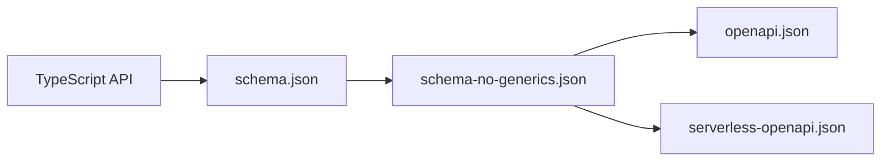

# Schema.json to OpenAPI converter

This project provides a utility to convert the [schema.json](../../output/schema) file representing the Elasticsearch API specification to OpenAPI version 3.0.3.

The conversion pipeline is the following:

This branch is the work for [PR #2047](https://github.com/elastic/elasticsearch-specification/pull/2047) where reviews and comments should be made.

The OpenAPI specification generated from the current `schema.json` can be found in the [output/openapi](../../output/openapi) directory.
